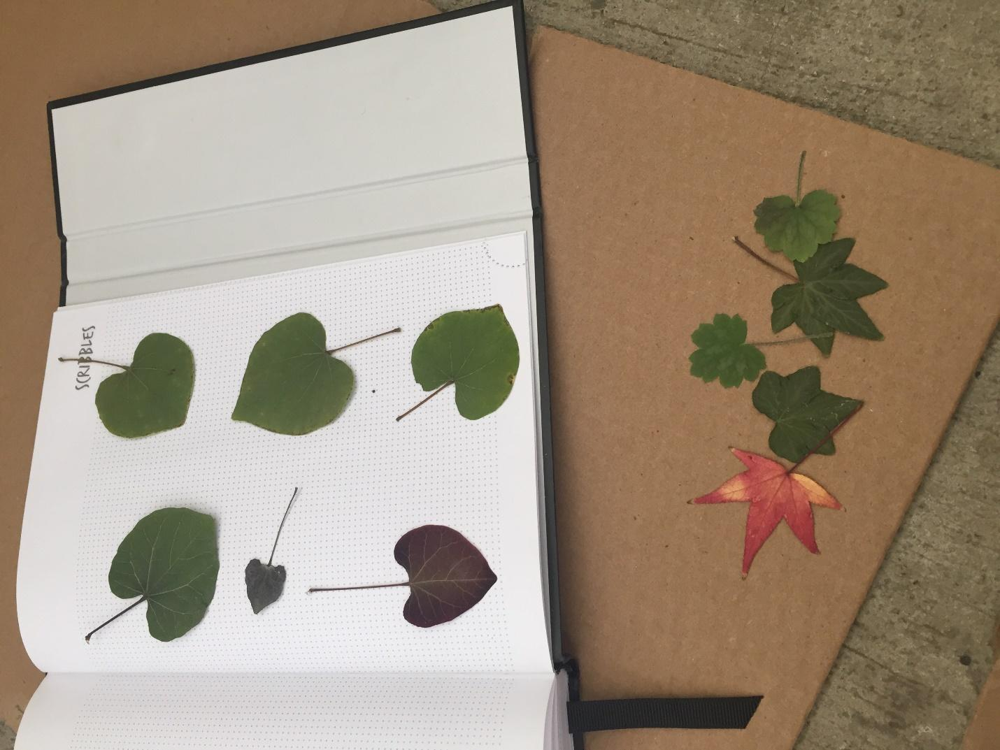
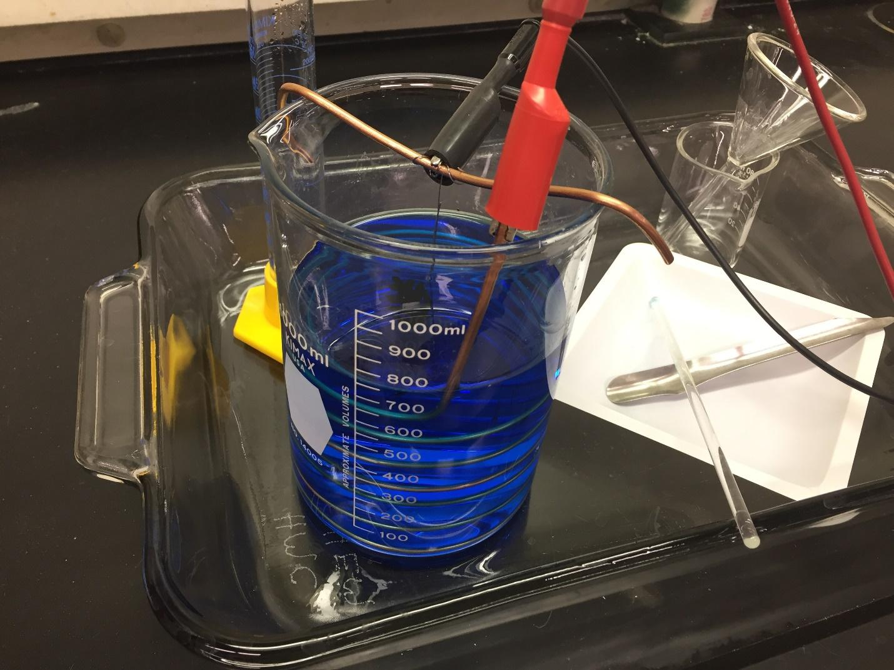
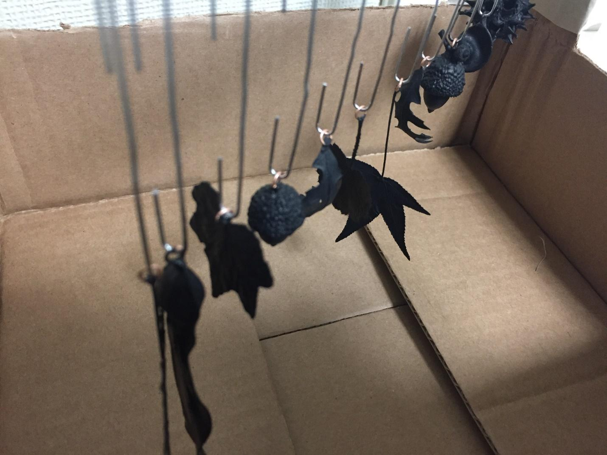
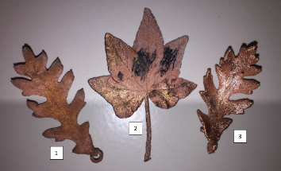

# Copper Electroplating Leaves, by Kathryn Chan

I was inspired to do this project from the jewelry made by Enchanted Leaves, and used their resources page as a guide.

I collected leaves from around campus and pressed them between the pages of a book for a week to let them dry. After this, I coated the leaves with a layer of polyurethane, glued a small copper jump ring to one end, and coated each with a layer of carbon graphite paint.

For the electroplating solution, we dissolved 150g of copper sulfate crystals into a solution of 30mL 98% sulfuric acid that was diluted to 750mL. We hung the piece with a segment of titanium wire attached to a wire bar that was able to rest across the rim of the beaker to keep the piece suspended in the solution. We attached the negative cable of the power supply to the piece and the positive cable to a 12 gauge copper wire coiled in the solution.

We ran the electroplating process once per day for several days and experimented with different levels of current. (We turned the voltage knob all the way up and allowed the amps setting to be the limiting factor.) Each piece was left in the solution with the power supply at a low current for 6 to 7 hours. [1] At 0.1 amps, most of the piece had plated (except for a small graphite-exposed spot) and had a thickness of about 0.5 mm. [2] The surface area of the second piece was somewhat larger, and a setting of 0.2 amps resulted in similar thickness. We suspect that some of the graphite paint had flaked off into the solution before it could be plated, resulting in black splotches. [3] The surface area of the third piece was similar to that of the first. We initially set the power supply to 0.5 amps for about 10 minutes to prevent the graphite paint from flaking, then to 0.25 amps for the remainder of the process. The resulting plated piece did not flake significantly, and had a thickness of around 1mm.

After electroplating, the pieces had an appearance similar to that of [1]. Polishing the pieces with a wire brush connected to a rotary tool resulted in a shinier appearance, as seen with [3].

Thanks to Ms. Manisco for allowing us to use the chemistry laboratory and providing supplies, and to Kye Shi and Hunter Whaples for helping set up the electroplating process.

 

